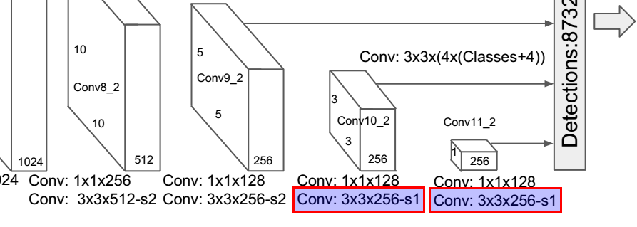
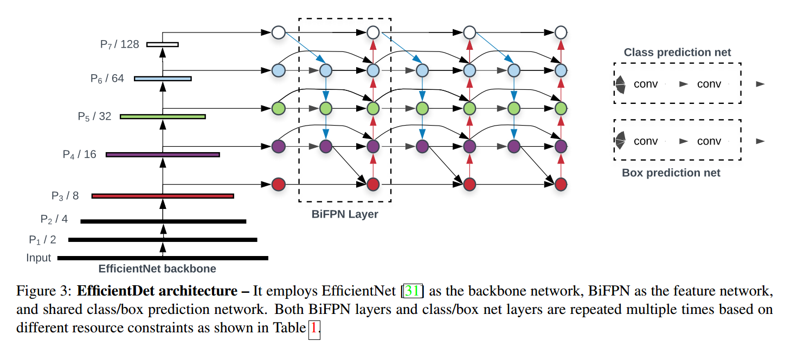
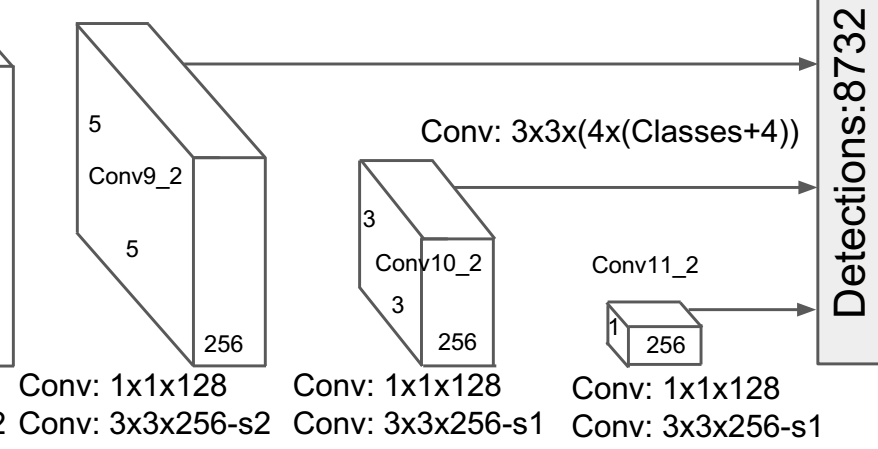

​                      

#                     目标检测系列论文阅读

[toc]

## Faster R-CNN: Towards Real-Time Object Detection with Region Proposal Networks  


## SSD: Single Shot MultiBox Detector

比较老的论文，但是是one stage的代表。

- ### FasterRCNN回顾


- 

- ### 主要贡献

1）提出SSD检测架构。具有比YOLO更快更准的单阶段检测器，具有和较慢的Faster RCNN一样的准确率。

2）SSD的核心思想是使用一组固定的default bounding box通过小的卷积核作用于特征图上对类别和边框的偏移（offset）进行预测。

3）为了获得高的检测准确率，在不同尺度特征图上进行预测。

4）简单的端到端（end to end）训练并获得高的准确率，提升了speed和accuracy两者的折中（trade-off）。

5）在PASCAL VOC，COCO和ILSVRC数据集上和近期的state of the art算法作出了timing和accuracy的对比。

- ### SSD架构

- #### Multi-scale feature maps for detection  

  在截断的主干网络后添加卷积层。不同于YOLO、FasterRCNN等，这些网络仅仅使用了最后一层特征图进行预测，SSD充分利用了主干网络提取特征形成的多尺度卷积特征图，在不同特征图上分别预测。

  

  

  

SSD300结构如下


使用上图中D结构，对VGG16作出相应改动：

- [ ] | idx  | operation                                                    | feature map size | prediction |
  | ---- | ------------------------------------------------------------ | ---------------- | ---------- |
  | 0    | Conv2d(3, 64, kernel_size=(3, 3), stride=(1, 1), padding=(1, 1)) | 300              |            |
  | 1    | **ReLU(inplace=True)**                                       |                  |            |
  | 2    | **Conv2d(64, 64, kernel_size=(3, 3), stride=(1, 1), padding=(1, 1))** |                  |            |
  | 3    | **ReLU(inplace=True),**                                      |                  |            |
  | 4    | **MaxPool2d(kernel_size=2, stride=2, padding=0, dilation=1, ceil_mode=False)** | 150              |            |
  | 5    | **Conv2d(64, 128, kernel_size=(3, 3), stride=(1, 1), padding=(1, 1))** |                  |            |
  | 6    | **ReLU(inplace=True)**                                       |                  |            |
  | 7    | **Conv2d(128, 128, kernel_size=(3, 3), stride=(1, 1), padding=(1, 1))** |                  |            |
  | 8    | **ReLU(inplace=True)**                                       |                  |            |
  | 9    | **MaxPool2d(kernel_size=2, stride=2, padding=0, dilation=1, ceil_mode=False)** | 75               |            |
  | 10   | **Conv2d(128, 256, kernel_size=(3, 3), stride=(1, 1), padding=(1, 1))** |                  |            |
  | 11   | **ReLU(inplace=True),**                                      |                  |            |
  | 12   | **Conv2d(256, 256, kernel_size=(3, 3), stride=(1, 1), padding=(1, 1))** |                  |            |
  | 13   | **ReLU(inplace=True)**                                       |                  |            |
  | 14   | **Conv2d(256, 256, kernel_size=(3, 3), stride=(1, 1), padding=(1, 1))** |                  |            |
  | 15   | **ReLU(inplace=True)**                                       |                  |            |
  | 16   | **MaxPool2d(kernel_size=2, stride=2, padding=0, dilation=1, ceil_mode=True)** | 38               |            |
  | 17   | **Conv2d(256, 512, kernel_size=(3, 3), stride=(1, 1), padding=(1, 1))** |                  |            |
  | 18   | **ReLU(inplace=True)**                                       |                  |            |
  | 19   | **Conv2d(512, 512, kernel_size=(3, 3), stride=(1, 1)，padding=(1, 1))** |                  |            |
  | 20   | **ReLU(inplace=True)**                                       |                  |            |
  | 21   | **Conv2d(512, 512, kernel_size=(3, 3), stride=(1, 1), padding=(1, 1))** |                  | Y          |
  | 22   | **ReLU(inplace=True),**                                      |                  |            |
  | 23   | **MaxPool2d(kernel_size=2, stride=2, padding=0, dilation=1, ceil_mode=False)** | 19               |            |
  | 24   | **Conv2d(512, 512, kernel_size=(3, 3), stride=(1, 1), padding=(1, 1))** |                  |            |
  | 25   | **ReLU(inplace=True),**                                      |                  |            |
  | 26   | **Conv2d(512, 512, kernel_size=(3, 3), stride=(1, 1), padding=(1, 1))** |                  |            |
  | 27   | **ReLU(inplace=True),**                                      |                  |            |
  | 28   | **Conv2d(512, 512, kernel_size=(3, 3), stride=(1, 1), padding=(1, 1))** |                  |            |
  | 29   | **ReLU(inplace=True),**                                      |                  |            |
  | 30   | **MaxPool2d(kernel_size=3, stride=1, padding=1, dilation=1, ceil_mode=False)** |                  |            |
  | 31   | **Conv2d(512, 1024, kernel_size=(3, 3), stride=(1, 1), padding=(6, 6), dilation=(6, 6))** |                  |            |
  | 32   | **ReLU(inplace=True)**                                       |                  |            |
  | 33   | **Conv2d(1024, 1024, kernel_size=(1, 1), stride=(1, 1))**    |                  | Y          |
  | 34   | **ReLU(inplace=True)**                                       | 19               |            |

额外层：

| **Conv8_1**  | **Conv2d(1024, 256, kernel_size=(1, 1), stride=(1, 1))**     | **19** |       |
| ------------ | ------------------------------------------------------------ | ------ | ----- |
| **Conv8_2**  | **Conv2d(256, 512, kernel_size=(3, 3), stride=(2, 2), padding=(1, 1))** | **10** | **Y** |
| **Conv9_1**  | **Conv2d(512, 128, kernel_size=(1, 1), stride=(1, 1))**      |        |       |
| **Conv9_2**  | **Conv2d(128, 256, kernel_size=(3, 3), stride=(2, 2)，padding=(1, 1))** | **5**  | **Y** |
| **Conv10_1** | **Conv2d(256, 128, kernel_size=(1, 1), stride=(1, 1))**      |        |       |
| **Conv10_2** | **Conv2d(128, 256, kernel_size=(3, 3), stride=(1, 1))**      | **3**  | **Y** |
| **Conv11_1** | **Conv2d(256, 128, kernel_size=(1, 1), stride=(1, 1))**      |        |       |
| **Conv11_2** | **Conv2d(128, 256, kernel_size=(3, 3)，stride=(1, 1)）**     | **1**  | **Y** |

【注意】论文中的SSD添加的额外层画的和具体实现有所不同，我们看一下作者在自己的Caffe源码上的实现：

```python
# Add extra layers on top of a "base" network (e.g. VGGNet or Inception).
def AddExtraLayers(net, use_batchnorm=True, lr_mult=1):
    use_relu = True

    # Add additional convolutional layers.
    # 19 x 19
    from_layer = net.keys()[-1]

    # TODO(weiliu89): Construct the name using the last layer to avoid duplication.
    # 10 x 10
    out_layer = "conv6_1"
    ConvBNLayer(net, from_layer, out_layer, use_batchnorm, use_relu, 256, 1, 0, 1,
        lr_mult=lr_mult)

    from_layer = out_layer
    out_layer = "conv6_2"
    ConvBNLayer(net, from_layer, out_layer, use_batchnorm, use_relu, 512, 3, 1, 2,
        lr_mult=lr_mult)

    # 5 x 5
    from_layer = out_layer
    out_layer = "conv7_1"
    ConvBNLayer(net, from_layer, out_layer, use_batchnorm, use_relu, 128, 1, 0, 1,
      lr_mult=lr_mult)

    from_layer = out_layer
    out_layer = "conv7_2"
    ConvBNLayer(net, from_layer, out_layer, use_batchnorm, use_relu, 256, 3, 1, 2,
      lr_mult=lr_mult)

    # 3 x 3
    from_layer = out_layer
    out_layer = "conv8_1"
    ConvBNLayer(net, from_layer, out_layer, use_batchnorm, use_relu, 128, 1, 0, 1,
      lr_mult=lr_mult)

    from_layer = out_layer
    out_layer = "conv8_2"
    ConvBNLayer(net, from_layer, out_layer, use_batchnorm, use_relu, 256, 3, 0, 1,
      lr_mult=lr_mult)

    # 1 x 1
    from_layer = out_layer
    out_layer = "conv9_1"
    ConvBNLayer(net, from_layer, out_layer, use_batchnorm, use_relu, 128, 1, 0, 1,
      lr_mult=lr_mult)

    from_layer = out_layer
    out_layer = "conv9_2"
    ConvBNLayer(net, from_layer, out_layer, use_batchnorm, use_relu, 256, 3, 0, 1,
      lr_mult=lr_mult)

    return net
```

**[注意]**可以看到在代码中的"conv8_2"、"conv9_2"实际上是没有做stride=2，pading=1的卷积的，这一点和论文结构图下方的文字相符：



事实上，Conv10_2和Conv11_2的卷积操并没有进行跨步stride=2，应该都是5x5x256。猜测特征图太小可能并不利于检测，因为损失的细节可能比较多，毕竟在YOLO v1和FasterRCNN中最后都是7x7的特征图，这里虽然最后两个预测特征图都是5x5，但是通过不同scale的default box依然可以检测不同尺度的目标。真是情况可能还是以实验结果为准，这里我们还是以caffe源码为准。不过值得一提是，在SSD512中，最后的一层预测特征图是1x1x256.


- #### VGG16模型转换

  vgg16_reducedfc.pth是vgg16去除两个全连接层FC6、FC7并且转换为卷积层的权重文件。上表显示VGG16一共35层，去除5个MaxPool2d和15个Relu激活层，还剩下15层卷积操作，我们看一下：

  ```
  VGG16 weights key: odict_keys(['0.weight', '0.bias', '2.weight', '2.bias', '5.weight', '5.bias', '7.weight', '7.bias', '10.weight', '10.bias', '12.weight', '12.bias', '14.weight', '14.bias', '17.weight', '17.bias', '19.weight', '19.bias', '21.weight', '21.bias', '24.weight', '24.bias', '26.weight', '26.bias', '28.weight', '28.bias', '31.weight', '31.bias', '33.weight', '33.bias'])
  VGG16 weights include layers: 30
  ```

  可以看到权重文件是pytorch标准的order dict数据结构，一共有30个参数，分权重w和偏置bias。正好对应了15个卷积层。

  验证看看每一层参数是什么：

  ```
  VGG16 layer 0 : 0.weight parameters shape torch.Size([64, 3, 3, 3])
  VGG16 layer 1 : 0.bias parameters shape torch.Size([64])
  VGG16 layer 2 : 2.weight parameters shape torch.Size([64, 64, 3, 3])
  VGG16 layer 3 : 2.bias parameters shape torch.Size([64])
  VGG16 layer 4 : 5.weight parameters shape torch.Size([128, 64, 3, 3])
  VGG16 layer 5 : 5.bias parameters shape torch.Size([128])
  VGG16 layer 6 : 7.weight parameters shape torch.Size([128, 128, 3, 3])
  VGG16 layer 7 : 7.bias parameters shape torch.Size([128])
  VGG16 layer 8 : 10.weight parameters shape torch.Size([256, 128, 3, 3])
  VGG16 layer 9 : 10.bias parameters shape torch.Size([256])
  VGG16 layer 10 : 12.weight parameters shape torch.Size([256, 256, 3, 3])
  VGG16 layer 11 : 12.bias parameters shape torch.Size([256])
  VGG16 layer 12 : 14.weight parameters shape torch.Size([256, 256, 3, 3])
  VGG16 layer 13 : 14.bias parameters shape torch.Size([256])
  VGG16 layer 14 : 17.weight parameters shape torch.Size([512, 256, 3, 3])
  VGG16 layer 15 : 17.bias parameters shape torch.Size([512])
  VGG16 layer 16 : 19.weight parameters shape torch.Size([512, 512, 3, 3])
  VGG16 layer 17 : 19.bias parameters shape torch.Size([512])
  VGG16 layer 18 : 21.weight parameters shape torch.Size([512, 512, 3, 3])
  VGG16 layer 19 : 21.bias parameters shape torch.Size([512])
  VGG16 layer 20 : 24.weight parameters shape torch.Size([512, 512, 3, 3])
  VGG16 layer 21 : 24.bias parameters shape torch.Size([512])
  VGG16 layer 22 : 26.weight parameters shape torch.Size([512, 512, 3, 3])
  VGG16 layer 23 : 26.bias parameters shape torch.Size([512])
  VGG16 layer 24 : 28.weight parameters shape torch.Size([512, 512, 3, 3])
  VGG16 layer 25 : 28.bias parameters shape torch.Size([512])
  VGG16 layer 26 : 31.weight parameters shape torch.Size([1024, 512, 3, 3])
  VGG16 layer 27 : 31.bias parameters shape torch.Size([1024])
  VGG16 layer 28 : 33.weight parameters shape torch.Size([1024, 1024, 1, 1])
  VGG16 layer 29 : 33.bias parameters shape torch.Size([1024])
  ```

  

- ### Convolutional predictors for detection  

  对于每一层特征


- #### 更改主干网络为EfficientNet-b4.

EfficientNet-b4和Vgg16具有相当的参数：

| model          | Top-1Acc.     Top-5Acc. | #Params |
| -------------- | ----------------------- | ------- |
| VGG-16         | 71.93%          90.67%  | 14.7M   |
| ResNet-50      | 76.0%             93.0% | 26M     |
| EfficientNet-B4 | 83.0%            96.3%  | 19M     |
|                |                         |         |

其中VGG16我们仅仅计算卷积层参数大约：138M - [（1000×4096+1000）+ （4096×4096+4096）+(224/2^5)^2 *512 *4096]/10^6=14.7M



借用EfficientDet论文中的图，可以看到P3相当于SSD300中Conv4_3。鉴于EfficientNet本身结构比较深，上图一直到P5都是EfficientNet主干网络。仿照SSD300结构，我们还是在最后添加类似Conv9-Conv11共6层，保持SSD300结构一致性。




| model                  | VOC2007 test mAP（0.5） | VOC2012 test mAP（0.5） |
| ---------------------- | ----------------------- | ----------------------- |
| SSD300-VGG16           |                         |                         |
| SSD300-EfficientNet-b4 |                         |                         |
|                        |                         |                         |


- ###### 架构EfficientNet主干网络

  efficientnet-b4结构如下：

  ```python
  efficientnet-b4: EfficientNet(
    (_conv_stem): Conv2dStaticSamePadding(
      3, 48, kernel_size=(3, 3), stride=(2, 2), bias=False
      (static_padding): ZeroPad2d(padding=(0, 1, 0, 1), value=0.0)
    )
    (_bn0): BatchNorm2d(48, eps=0.001, momentum=0.010000000000000009, affine=True, track_running_stats=True)
    (_blocks): ModuleList(
      (0): MBConvBlock(
        (_depthwise_conv): Conv2dStaticSamePadding(
          48, 48, kernel_size=(3, 3), stride=[1, 1], groups=48, bias=False
          (static_padding): ZeroPad2d(padding=(1, 1, 1, 1), value=0.0)
        )
        (_bn1): BatchNorm2d(48, eps=0.001, momentum=0.010000000000000009, affine=True, track_running_stats=True)
        (_se_reduce): Conv2dStaticSamePadding(
          48, 12, kernel_size=(1, 1), stride=(1, 1)
          (static_padding): Identity()
        )
        (_se_expand): Conv2dStaticSamePadding(
          12, 48, kernel_size=(1, 1), stride=(1, 1)
          (static_padding): Identity()
        )
        (_project_conv): Conv2dStaticSamePadding(
          48, 24, kernel_size=(1, 1), stride=(1, 1), bias=False
          (static_padding): Identity()
        )
        (_bn2): BatchNorm2d(24, eps=0.001, momentum=0.010000000000000009, affine=True, track_running_stats=True)
        (_swish): MemoryEfficientSwish()
      )
      (1): MBConvBlock(
        (_depthwise_conv): Conv2dStaticSamePadding(
          24, 24, kernel_size=(3, 3), stride=(1, 1), groups=24, bias=False
          (static_padding): ZeroPad2d(padding=(1, 1, 1, 1), value=0.0)
        )
        (_bn1): BatchNorm2d(24, eps=0.001, momentum=0.010000000000000009, affine=True, track_running_stats=True)
        (_se_reduce): Conv2dStaticSamePadding(
          24, 6, kernel_size=(1, 1), stride=(1, 1)
          (static_padding): Identity()
        )
        (_se_expand): Conv2dStaticSamePadding(
          6, 24, kernel_size=(1, 1), stride=(1, 1)
          (static_padding): Identity()
        )
        (_project_conv): Conv2dStaticSamePadding(
          24, 24, kernel_size=(1, 1), stride=(1, 1), bias=False
          (static_padding): Identity()
        )
        (_bn2): BatchNorm2d(24, eps=0.001, momentum=0.010000000000000009, affine=True, track_running_stats=True)
        (_swish): MemoryEfficientSwish()
      )
      (2): MBConvBlock(
        (_expand_conv): Conv2dStaticSamePadding(
          24, 144, kernel_size=(1, 1), stride=(1, 1), bias=False
          (static_padding): Identity()
        )
        (_bn0): BatchNorm2d(144, eps=0.001, momentum=0.010000000000000009, affine=True, track_running_stats=True)
        (_depthwise_conv): Conv2dStaticSamePadding(
          144, 144, kernel_size=(3, 3), stride=[2, 2], groups=144, bias=False
          (static_padding): ZeroPad2d(padding=(0, 1, 0, 1), value=0.0)
        )
        (_bn1): BatchNorm2d(144, eps=0.001, momentum=0.010000000000000009, affine=True, track_running_stats=True)
        (_se_reduce): Conv2dStaticSamePadding(
          144, 6, kernel_size=(1, 1), stride=(1, 1)
          (static_padding): Identity()
        )
        (_se_expand): Conv2dStaticSamePadding(
          6, 144, kernel_size=(1, 1), stride=(1, 1)
          (static_padding): Identity()
        )
        (_project_conv): Conv2dStaticSamePadding(
          144, 32, kernel_size=(1, 1), stride=(1, 1), bias=False
          (static_padding): Identity()
        )
        (_bn2): BatchNorm2d(32, eps=0.001, momentum=0.010000000000000009, affine=True, track_running_stats=True)
        (_swish): MemoryEfficientSwish()
      )
      (3): MBConvBlock(
        (_expand_conv): Conv2dStaticSamePadding(
          32, 192, kernel_size=(1, 1), stride=(1, 1), bias=False
          (static_padding): Identity()
        )
        (_bn0): BatchNorm2d(192, eps=0.001, momentum=0.010000000000000009, affine=True, track_running_stats=True)
        (_depthwise_conv): Conv2dStaticSamePadding(
          192, 192, kernel_size=(3, 3), stride=(1, 1), groups=192, bias=False
          (static_padding): ZeroPad2d(padding=(1, 1, 1, 1), value=0.0)
        )
        (_bn1): BatchNorm2d(192, eps=0.001, momentum=0.010000000000000009, affine=True, track_running_stats=True)
        (_se_reduce): Conv2dStaticSamePadding(
          192, 8, kernel_size=(1, 1), stride=(1, 1)
          (static_padding): Identity()
        )
        (_se_expand): Conv2dStaticSamePadding(
          8, 192, kernel_size=(1, 1), stride=(1, 1)
          (static_padding): Identity()
        )
        (_project_conv): Conv2dStaticSamePadding(
          192, 32, kernel_size=(1, 1), stride=(1, 1), bias=False
          (static_padding): Identity()
        )
        (_bn2): BatchNorm2d(32, eps=0.001, momentum=0.010000000000000009, affine=True, track_running_stats=True)
        (_swish): MemoryEfficientSwish()
      )
      (4): MBConvBlock(
        (_expand_conv): Conv2dStaticSamePadding(
          32, 192, kernel_size=(1, 1), stride=(1, 1), bias=False
          (static_padding): Identity()
        )
        (_bn0): BatchNorm2d(192, eps=0.001, momentum=0.010000000000000009, affine=True, track_running_stats=True)
        (_depthwise_conv): Conv2dStaticSamePadding(
          192, 192, kernel_size=(3, 3), stride=(1, 1), groups=192, bias=False
          (static_padding): ZeroPad2d(padding=(1, 1, 1, 1), value=0.0)
        )
        (_bn1): BatchNorm2d(192, eps=0.001, momentum=0.010000000000000009, affine=True, track_running_stats=True)
        (_se_reduce): Conv2dStaticSamePadding(
          192, 8, kernel_size=(1, 1), stride=(1, 1)
          (static_padding): Identity()
        )
        (_se_expand): Conv2dStaticSamePadding(
          8, 192, kernel_size=(1, 1), stride=(1, 1)
          (static_padding): Identity()
        )
        (_project_conv): Conv2dStaticSamePadding(
          192, 32, kernel_size=(1, 1), stride=(1, 1), bias=False
          (static_padding): Identity()
        )
        (_bn2): BatchNorm2d(32, eps=0.001, momentum=0.010000000000000009, affine=True, track_running_stats=True)
        (_swish): MemoryEfficientSwish()
      )
      (5): MBConvBlock(
        (_expand_conv): Conv2dStaticSamePadding(
          32, 192, kernel_size=(1, 1), stride=(1, 1), bias=False
          (static_padding): Identity()
        )
        (_bn0): BatchNorm2d(192, eps=0.001, momentum=0.010000000000000009, affine=True, track_running_stats=True)
        (_depthwise_conv): Conv2dStaticSamePadding(
          192, 192, kernel_size=(3, 3), stride=(1, 1), groups=192, bias=False
          (static_padding): ZeroPad2d(padding=(1, 1, 1, 1), value=0.0)
        )
        (_bn1): BatchNorm2d(192, eps=0.001, momentum=0.010000000000000009, affine=True, track_running_stats=True)
        (_se_reduce): Conv2dStaticSamePadding(
          192, 8, kernel_size=(1, 1), stride=(1, 1)
          (static_padding): Identity()
        )
        (_se_expand): Conv2dStaticSamePadding(
          8, 192, kernel_size=(1, 1), stride=(1, 1)
          (static_padding): Identity()
        )
        (_project_conv): Conv2dStaticSamePadding(
          192, 32, kernel_size=(1, 1), stride=(1, 1), bias=False
          (static_padding): Identity()
        )
        (_bn2): BatchNorm2d(32, eps=0.001, momentum=0.010000000000000009, affine=True, track_running_stats=True)
        (_swish): MemoryEfficientSwish()
      )
      (6): MBConvBlock(
        (_expand_conv): Conv2dStaticSamePadding(
          32, 192, kernel_size=(1, 1), stride=(1, 1), bias=False
          (static_padding): Identity()
        )
        (_bn0): BatchNorm2d(192, eps=0.001, momentum=0.010000000000000009, affine=True, track_running_stats=True)
        (_depthwise_conv): Conv2dStaticSamePadding(
          192, 192, kernel_size=(5, 5), stride=[2, 2], groups=192, bias=False
          (static_padding): ZeroPad2d(padding=(1, 2, 1, 2), value=0.0)
        )
        (_bn1): BatchNorm2d(192, eps=0.001, momentum=0.010000000000000009, affine=True, track_running_stats=True)
        (_se_reduce): Conv2dStaticSamePadding(
          192, 8, kernel_size=(1, 1), stride=(1, 1)
          (static_padding): Identity()
        )
        (_se_expand): Conv2dStaticSamePadding(
          8, 192, kernel_size=(1, 1), stride=(1, 1)
          (static_padding): Identity()
        )
        (_project_conv): Conv2dStaticSamePadding(
          192, 56, kernel_size=(1, 1), stride=(1, 1), bias=False
          (static_padding): Identity()
        )
        (_bn2): BatchNorm2d(56, eps=0.001, momentum=0.010000000000000009, affine=True, track_running_stats=True)
        (_swish): MemoryEfficientSwish()
      )
      (7): MBConvBlock(
        (_expand_conv): Conv2dStaticSamePadding(
          56, 336, kernel_size=(1, 1), stride=(1, 1), bias=False
          (static_padding): Identity()
        )
        (_bn0): BatchNorm2d(336, eps=0.001, momentum=0.010000000000000009, affine=True, track_running_stats=True)
        (_depthwise_conv): Conv2dStaticSamePadding(
          336, 336, kernel_size=(5, 5), stride=(1, 1), groups=336, bias=False
          (static_padding): ZeroPad2d(padding=(2, 2, 2, 2), value=0.0)
        )
        (_bn1): BatchNorm2d(336, eps=0.001, momentum=0.010000000000000009, affine=True, track_running_stats=True)
        (_se_reduce): Conv2dStaticSamePadding(
          336, 14, kernel_size=(1, 1), stride=(1, 1)
          (static_padding): Identity()
        )
        (_se_expand): Conv2dStaticSamePadding(
          14, 336, kernel_size=(1, 1), stride=(1, 1)
          (static_padding): Identity()
        )
        (_project_conv): Conv2dStaticSamePadding(
          336, 56, kernel_size=(1, 1), stride=(1, 1), bias=False
          (static_padding): Identity()
        )
        (_bn2): BatchNorm2d(56, eps=0.001, momentum=0.010000000000000009, affine=True, track_running_stats=True)
        (_swish): MemoryEfficientSwish()
      )
      (8): MBConvBlock(
        (_expand_conv): Conv2dStaticSamePadding(
          56, 336, kernel_size=(1, 1), stride=(1, 1), bias=False
          (static_padding): Identity()
        )
        (_bn0): BatchNorm2d(336, eps=0.001, momentum=0.010000000000000009, affine=True, track_running_stats=True)
        (_depthwise_conv): Conv2dStaticSamePadding(
          336, 336, kernel_size=(5, 5), stride=(1, 1), groups=336, bias=False
          (static_padding): ZeroPad2d(padding=(2, 2, 2, 2), value=0.0)
        )
        (_bn1): BatchNorm2d(336, eps=0.001, momentum=0.010000000000000009, affine=True, track_running_stats=True)
        (_se_reduce): Conv2dStaticSamePadding(
          336, 14, kernel_size=(1, 1), stride=(1, 1)
          (static_padding): Identity()
        )
        (_se_expand): Conv2dStaticSamePadding(
          14, 336, kernel_size=(1, 1), stride=(1, 1)
          (static_padding): Identity()
        )
        (_project_conv): Conv2dStaticSamePadding(
          336, 56, kernel_size=(1, 1), stride=(1, 1), bias=False
          (static_padding): Identity()
        )
        (_bn2): BatchNorm2d(56, eps=0.001, momentum=0.010000000000000009, affine=True, track_running_stats=True)
        (_swish): MemoryEfficientSwish()
      )
      (9): MBConvBlock(
        (_expand_conv): Conv2dStaticSamePadding(
          56, 336, kernel_size=(1, 1), stride=(1, 1), bias=False
          (static_padding): Identity()
        )
        (_bn0): BatchNorm2d(336, eps=0.001, momentum=0.010000000000000009, affine=True, track_running_stats=True)
        (_depthwise_conv): Conv2dStaticSamePadding(
          336, 336, kernel_size=(5, 5), stride=(1, 1), groups=336, bias=False
          (static_padding): ZeroPad2d(padding=(2, 2, 2, 2), value=0.0)
        )
        (_bn1): BatchNorm2d(336, eps=0.001, momentum=0.010000000000000009, affine=True, track_running_stats=True)
        (_se_reduce): Conv2dStaticSamePadding(
          336, 14, kernel_size=(1, 1), stride=(1, 1)
          (static_padding): Identity()
        )
        (_se_expand): Conv2dStaticSamePadding(
          14, 336, kernel_size=(1, 1), stride=(1, 1)
          (static_padding): Identity()
        )
        (_project_conv): Conv2dStaticSamePadding(
          336, 56, kernel_size=(1, 1), stride=(1, 1), bias=False
          (static_padding): Identity()
        )
        (_bn2): BatchNorm2d(56, eps=0.001, momentum=0.010000000000000009, affine=True, track_running_stats=True)
        (_swish): MemoryEfficientSwish()
      )
      (10): MBConvBlock(
        (_expand_conv): Conv2dStaticSamePadding(
          56, 336, kernel_size=(1, 1), stride=(1, 1), bias=False
          (static_padding): Identity()
        )
        (_bn0): BatchNorm2d(336, eps=0.001, momentum=0.010000000000000009, affine=True, track_running_stats=True)
        (_depthwise_conv): Conv2dStaticSamePadding(
          336, 336, kernel_size=(3, 3), stride=[2, 2], groups=336, bias=False
          (static_padding): ZeroPad2d(padding=(0, 1, 0, 1), value=0.0)
        )
        (_bn1): BatchNorm2d(336, eps=0.001, momentum=0.010000000000000009, affine=True, track_running_stats=True)
        (_se_reduce): Conv2dStaticSamePadding(
          336, 14, kernel_size=(1, 1), stride=(1, 1)
          (static_padding): Identity()
        )
        (_se_expand): Conv2dStaticSamePadding(
          14, 336, kernel_size=(1, 1), stride=(1, 1)
          (static_padding): Identity()
        )
        (_project_conv): Conv2dStaticSamePadding(
          336, 112, kernel_size=(1, 1), stride=(1, 1), bias=False
          (static_padding): Identity()
        )
        (_bn2): BatchNorm2d(112, eps=0.001, momentum=0.010000000000000009, affine=True, track_running_stats=True)
        (_swish): MemoryEfficientSwish()
      )
      (11): MBConvBlock(
        (_expand_conv): Conv2dStaticSamePadding(
          112, 672, kernel_size=(1, 1), stride=(1, 1), bias=False
          (static_padding): Identity()
        )
        (_bn0): BatchNorm2d(672, eps=0.001, momentum=0.010000000000000009, affine=True, track_running_stats=True)
        (_depthwise_conv): Conv2dStaticSamePadding(
          672, 672, kernel_size=(3, 3), stride=(1, 1), groups=672, bias=False
          (static_padding): ZeroPad2d(padding=(1, 1, 1, 1), value=0.0)
        )
        (_bn1): BatchNorm2d(672, eps=0.001, momentum=0.010000000000000009, affine=True, track_running_stats=True)
        (_se_reduce): Conv2dStaticSamePadding(
          672, 28, kernel_size=(1, 1), stride=(1, 1)
          (static_padding): Identity()
        )
        (_se_expand): Conv2dStaticSamePadding(
          28, 672, kernel_size=(1, 1), stride=(1, 1)
          (static_padding): Identity()
        )
        (_project_conv): Conv2dStaticSamePadding(
          672, 112, kernel_size=(1, 1), stride=(1, 1), bias=False
          (static_padding): Identity()
        )
        (_bn2): BatchNorm2d(112, eps=0.001, momentum=0.010000000000000009, affine=True, track_running_stats=True)
        (_swish): MemoryEfficientSwish()
      )
      (12): MBConvBlock(
        (_expand_conv): Conv2dStaticSamePadding(
          112, 672, kernel_size=(1, 1), stride=(1, 1), bias=False
          (static_padding): Identity()
        )
        (_bn0): BatchNorm2d(672, eps=0.001, momentum=0.010000000000000009, affine=True, track_running_stats=True)
        (_depthwise_conv): Conv2dStaticSamePadding(
          672, 672, kernel_size=(3, 3), stride=(1, 1), groups=672, bias=False
          (static_padding): ZeroPad2d(padding=(1, 1, 1, 1), value=0.0)
        )
        (_bn1): BatchNorm2d(672, eps=0.001, momentum=0.010000000000000009, affine=True, track_running_stats=True)
        (_se_reduce): Conv2dStaticSamePadding(
          672, 28, kernel_size=(1, 1), stride=(1, 1)
          (static_padding): Identity()
        )
        (_se_expand): Conv2dStaticSamePadding(
          28, 672, kernel_size=(1, 1), stride=(1, 1)
          (static_padding): Identity()
        )
        (_project_conv): Conv2dStaticSamePadding(
          672, 112, kernel_size=(1, 1), stride=(1, 1), bias=False
          (static_padding): Identity()
        )
        (_bn2): BatchNorm2d(112, eps=0.001, momentum=0.010000000000000009, affine=True, track_running_stats=True)
        (_swish): MemoryEfficientSwish()
      )
      (13): MBConvBlock(
        (_expand_conv): Conv2dStaticSamePadding(
          112, 672, kernel_size=(1, 1), stride=(1, 1), bias=False
          (static_padding): Identity()
        )
        (_bn0): BatchNorm2d(672, eps=0.001, momentum=0.010000000000000009, affine=True, track_running_stats=True)
        (_depthwise_conv): Conv2dStaticSamePadding(
          672, 672, kernel_size=(3, 3), stride=(1, 1), groups=672, bias=False
          (static_padding): ZeroPad2d(padding=(1, 1, 1, 1), value=0.0)
        )
        (_bn1): BatchNorm2d(672, eps=0.001, momentum=0.010000000000000009, affine=True, track_running_stats=True)
        (_se_reduce): Conv2dStaticSamePadding(
          672, 28, kernel_size=(1, 1), stride=(1, 1)
          (static_padding): Identity()
        )
        (_se_expand): Conv2dStaticSamePadding(
          28, 672, kernel_size=(1, 1), stride=(1, 1)
          (static_padding): Identity()
        )
        (_project_conv): Conv2dStaticSamePadding(
          672, 112, kernel_size=(1, 1), stride=(1, 1), bias=False
          (static_padding): Identity()
        )
        (_bn2): BatchNorm2d(112, eps=0.001, momentum=0.010000000000000009, affine=True, track_running_stats=True)
        (_swish): MemoryEfficientSwish()
      )
      (14): MBConvBlock(
        (_expand_conv): Conv2dStaticSamePadding(
          112, 672, kernel_size=(1, 1), stride=(1, 1), bias=False
          (static_padding): Identity()
        )
        (_bn0): BatchNorm2d(672, eps=0.001, momentum=0.010000000000000009, affine=True, track_running_stats=True)
        (_depthwise_conv): Conv2dStaticSamePadding(
          672, 672, kernel_size=(3, 3), stride=(1, 1), groups=672, bias=False
          (static_padding): ZeroPad2d(padding=(1, 1, 1, 1), value=0.0)
        )
        (_bn1): BatchNorm2d(672, eps=0.001, momentum=0.010000000000000009, affine=True, track_running_stats=True)
        (_se_reduce): Conv2dStaticSamePadding(
          672, 28, kernel_size=(1, 1), stride=(1, 1)
          (static_padding): Identity()
        )
        (_se_expand): Conv2dStaticSamePadding(
          28, 672, kernel_size=(1, 1), stride=(1, 1)
          (static_padding): Identity()
        )
        (_project_conv): Conv2dStaticSamePadding(
          672, 112, kernel_size=(1, 1), stride=(1, 1), bias=False
          (static_padding): Identity()
        )
        (_bn2): BatchNorm2d(112, eps=0.001, momentum=0.010000000000000009, affine=True, track_running_stats=True)
        (_swish): MemoryEfficientSwish()
      )
      (15): MBConvBlock(
        (_expand_conv): Conv2dStaticSamePadding(
          112, 672, kernel_size=(1, 1), stride=(1, 1), bias=False
          (static_padding): Identity()
        )
        (_bn0): BatchNorm2d(672, eps=0.001, momentum=0.010000000000000009, affine=True, track_running_stats=True)
        (_depthwise_conv): Conv2dStaticSamePadding(
          672, 672, kernel_size=(3, 3), stride=(1, 1), groups=672, bias=False
          (static_padding): ZeroPad2d(padding=(1, 1, 1, 1), value=0.0)
        )
        (_bn1): BatchNorm2d(672, eps=0.001, momentum=0.010000000000000009, affine=True, track_running_stats=True)
        (_se_reduce): Conv2dStaticSamePadding(
          672, 28, kernel_size=(1, 1), stride=(1, 1)
          (static_padding): Identity()
        )
        (_se_expand): Conv2dStaticSamePadding(
          28, 672, kernel_size=(1, 1), stride=(1, 1)
          (static_padding): Identity()
        )
        (_project_conv): Conv2dStaticSamePadding(
          672, 112, kernel_size=(1, 1), stride=(1, 1), bias=False
          (static_padding): Identity()
        )
        (_bn2): BatchNorm2d(112, eps=0.001, momentum=0.010000000000000009, affine=True, track_running_stats=True)
        (_swish): MemoryEfficientSwish()
      )
      (16): MBConvBlock(
        (_expand_conv): Conv2dStaticSamePadding(
          112, 672, kernel_size=(1, 1), stride=(1, 1), bias=False
          (static_padding): Identity()
        )
        (_bn0): BatchNorm2d(672, eps=0.001, momentum=0.010000000000000009, affine=True, track_running_stats=True)
        (_depthwise_conv): Conv2dStaticSamePadding(
          672, 672, kernel_size=(5, 5), stride=[1, 1], groups=672, bias=False
          (static_padding): ZeroPad2d(padding=(2, 2, 2, 2), value=0.0)
        )
        (_bn1): BatchNorm2d(672, eps=0.001, momentum=0.010000000000000009, affine=True, track_running_stats=True)
        (_se_reduce): Conv2dStaticSamePadding(
          672, 28, kernel_size=(1, 1), stride=(1, 1)
          (static_padding): Identity()
        )
        (_se_expand): Conv2dStaticSamePadding(
          28, 672, kernel_size=(1, 1), stride=(1, 1)
          (static_padding): Identity()
        )
        (_project_conv): Conv2dStaticSamePadding(
          672, 160, kernel_size=(1, 1), stride=(1, 1), bias=False
          (static_padding): Identity()
        )
        (_bn2): BatchNorm2d(160, eps=0.001, momentum=0.010000000000000009, affine=True, track_running_stats=True)
        (_swish): MemoryEfficientSwish()
      )
      (17): MBConvBlock(
        (_expand_conv): Conv2dStaticSamePadding(
          160, 960, kernel_size=(1, 1), stride=(1, 1), bias=False
          (static_padding): Identity()
        )
        (_bn0): BatchNorm2d(960, eps=0.001, momentum=0.010000000000000009, affine=True, track_running_stats=True)
        (_depthwise_conv): Conv2dStaticSamePadding(
          960, 960, kernel_size=(5, 5), stride=(1, 1), groups=960, bias=False
          (static_padding): ZeroPad2d(padding=(2, 2, 2, 2), value=0.0)
        )
        (_bn1): BatchNorm2d(960, eps=0.001, momentum=0.010000000000000009, affine=True, track_running_stats=True)
        (_se_reduce): Conv2dStaticSamePadding(
          960, 40, kernel_size=(1, 1), stride=(1, 1)
          (static_padding): Identity()
        )
        (_se_expand): Conv2dStaticSamePadding(
          40, 960, kernel_size=(1, 1), stride=(1, 1)
          (static_padding): Identity()
        )
        (_project_conv): Conv2dStaticSamePadding(
          960, 160, kernel_size=(1, 1), stride=(1, 1), bias=False
          (static_padding): Identity()
        )
        (_bn2): BatchNorm2d(160, eps=0.001, momentum=0.010000000000000009, affine=True, track_running_stats=True)
        (_swish): MemoryEfficientSwish()
      )
      (18): MBConvBlock(
        (_expand_conv): Conv2dStaticSamePadding(
          160, 960, kernel_size=(1, 1), stride=(1, 1), bias=False
          (static_padding): Identity()
        )
        (_bn0): BatchNorm2d(960, eps=0.001, momentum=0.010000000000000009, affine=True, track_running_stats=True)
        (_depthwise_conv): Conv2dStaticSamePadding(
          960, 960, kernel_size=(5, 5), stride=(1, 1), groups=960, bias=False
          (static_padding): ZeroPad2d(padding=(2, 2, 2, 2), value=0.0)
        )
        (_bn1): BatchNorm2d(960, eps=0.001, momentum=0.010000000000000009, affine=True, track_running_stats=True)
        (_se_reduce): Conv2dStaticSamePadding(
          960, 40, kernel_size=(1, 1), stride=(1, 1)
          (static_padding): Identity()
        )
        (_se_expand): Conv2dStaticSamePadding(
          40, 960, kernel_size=(1, 1), stride=(1, 1)
          (static_padding): Identity()
        )
        (_project_conv): Conv2dStaticSamePadding(
          960, 160, kernel_size=(1, 1), stride=(1, 1), bias=False
          (static_padding): Identity()
        )
        (_bn2): BatchNorm2d(160, eps=0.001, momentum=0.010000000000000009, affine=True, track_running_stats=True)
        (_swish): MemoryEfficientSwish()
      )
      (19): MBConvBlock(
        (_expand_conv): Conv2dStaticSamePadding(
          160, 960, kernel_size=(1, 1), stride=(1, 1), bias=False
          (static_padding): Identity()
        )
        (_bn0): BatchNorm2d(960, eps=0.001, momentum=0.010000000000000009, affine=True, track_running_stats=True)
        (_depthwise_conv): Conv2dStaticSamePadding(
          960, 960, kernel_size=(5, 5), stride=(1, 1), groups=960, bias=False
          (static_padding): ZeroPad2d(padding=(2, 2, 2, 2), value=0.0)
        )
        (_bn1): BatchNorm2d(960, eps=0.001, momentum=0.010000000000000009, affine=True, track_running_stats=True)
        (_se_reduce): Conv2dStaticSamePadding(
          960, 40, kernel_size=(1, 1), stride=(1, 1)
          (static_padding): Identity()
        )
        (_se_expand): Conv2dStaticSamePadding(
          40, 960, kernel_size=(1, 1), stride=(1, 1)
          (static_padding): Identity()
        )
        (_project_conv): Conv2dStaticSamePadding(
          960, 160, kernel_size=(1, 1), stride=(1, 1), bias=False
          (static_padding): Identity()
        )
        (_bn2): BatchNorm2d(160, eps=0.001, momentum=0.010000000000000009, affine=True, track_running_stats=True)
        (_swish): MemoryEfficientSwish()
      )
      (20): MBConvBlock(
        (_expand_conv): Conv2dStaticSamePadding(
          160, 960, kernel_size=(1, 1), stride=(1, 1), bias=False
          (static_padding): Identity()
        )
        (_bn0): BatchNorm2d(960, eps=0.001, momentum=0.010000000000000009, affine=True, track_running_stats=True)
        (_depthwise_conv): Conv2dStaticSamePadding(
          960, 960, kernel_size=(5, 5), stride=(1, 1), groups=960, bias=False
          (static_padding): ZeroPad2d(padding=(2, 2, 2, 2), value=0.0)
        )
        (_bn1): BatchNorm2d(960, eps=0.001, momentum=0.010000000000000009, affine=True, track_running_stats=True)
        (_se_reduce): Conv2dStaticSamePadding(
          960, 40, kernel_size=(1, 1), stride=(1, 1)
          (static_padding): Identity()
        )
        (_se_expand): Conv2dStaticSamePadding(
          40, 960, kernel_size=(1, 1), stride=(1, 1)
          (static_padding): Identity()
        )
        (_project_conv): Conv2dStaticSamePadding(
          960, 160, kernel_size=(1, 1), stride=(1, 1), bias=False
          (static_padding): Identity()
        )
        (_bn2): BatchNorm2d(160, eps=0.001, momentum=0.010000000000000009, affine=True, track_running_stats=True)
        (_swish): MemoryEfficientSwish()
      )
      (21): MBConvBlock(
        (_expand_conv): Conv2dStaticSamePadding(
          160, 960, kernel_size=(1, 1), stride=(1, 1), bias=False
          (static_padding): Identity()
        )
        (_bn0): BatchNorm2d(960, eps=0.001, momentum=0.010000000000000009, affine=True, track_running_stats=True)
        (_depthwise_conv): Conv2dStaticSamePadding(
          960, 960, kernel_size=(5, 5), stride=(1, 1), groups=960, bias=False
          (static_padding): ZeroPad2d(padding=(2, 2, 2, 2), value=0.0)
        )
        (_bn1): BatchNorm2d(960, eps=0.001, momentum=0.010000000000000009, affine=True, track_running_stats=True)
        (_se_reduce): Conv2dStaticSamePadding(
          960, 40, kernel_size=(1, 1), stride=(1, 1)
          (static_padding): Identity()
        )
        (_se_expand): Conv2dStaticSamePadding(
          40, 960, kernel_size=(1, 1), stride=(1, 1)
          (static_padding): Identity()
        )
        (_project_conv): Conv2dStaticSamePadding(
          960, 160, kernel_size=(1, 1), stride=(1, 1), bias=False
          (static_padding): Identity()
        )
        (_bn2): BatchNorm2d(160, eps=0.001, momentum=0.010000000000000009, affine=True, track_running_stats=True)
        (_swish): MemoryEfficientSwish()
      )
      (22): MBConvBlock(
        (_expand_conv): Conv2dStaticSamePadding(
          160, 960, kernel_size=(1, 1), stride=(1, 1), bias=False
          (static_padding): Identity()
        )
        (_bn0): BatchNorm2d(960, eps=0.001, momentum=0.010000000000000009, affine=True, track_running_stats=True)
        (_depthwise_conv): Conv2dStaticSamePadding(
          960, 960, kernel_size=(5, 5), stride=[2, 2], groups=960, bias=False
          (static_padding): ZeroPad2d(padding=(1, 2, 1, 2), value=0.0)
        )
        (_bn1): BatchNorm2d(960, eps=0.001, momentum=0.010000000000000009, affine=True, track_running_stats=True)
        (_se_reduce): Conv2dStaticSamePadding(
          960, 40, kernel_size=(1, 1), stride=(1, 1)
          (static_padding): Identity()
        )
        (_se_expand): Conv2dStaticSamePadding(
          40, 960, kernel_size=(1, 1), stride=(1, 1)
          (static_padding): Identity()
        )
        (_project_conv): Conv2dStaticSamePadding(
          960, 272, kernel_size=(1, 1), stride=(1, 1), bias=False
          (static_padding): Identity()
        )
        (_bn2): BatchNorm2d(272, eps=0.001, momentum=0.010000000000000009, affine=True, track_running_stats=True)
        (_swish): MemoryEfficientSwish()
      )
      (23): MBConvBlock(
        (_expand_conv): Conv2dStaticSamePadding(
          272, 1632, kernel_size=(1, 1), stride=(1, 1), bias=False
          (static_padding): Identity()
        )
        (_bn0): BatchNorm2d(1632, eps=0.001, momentum=0.010000000000000009, affine=True, track_running_stats=True)
        (_depthwise_conv): Conv2dStaticSamePadding(
          1632, 1632, kernel_size=(5, 5), stride=(1, 1), groups=1632, bias=False
          (static_padding): ZeroPad2d(padding=(2, 2, 2, 2), value=0.0)
        )
        (_bn1): BatchNorm2d(1632, eps=0.001, momentum=0.010000000000000009, affine=True, track_running_stats=True)
        (_se_reduce): Conv2dStaticSamePadding(
          1632, 68, kernel_size=(1, 1), stride=(1, 1)
          (static_padding): Identity()
        )
        (_se_expand): Conv2dStaticSamePadding(
          68, 1632, kernel_size=(1, 1), stride=(1, 1)
          (static_padding): Identity()
        )
        (_project_conv): Conv2dStaticSamePadding(
          1632, 272, kernel_size=(1, 1), stride=(1, 1), bias=False
          (static_padding): Identity()
        )
        (_bn2): BatchNorm2d(272, eps=0.001, momentum=0.010000000000000009, affine=True, track_running_stats=True)
        (_swish): MemoryEfficientSwish()
      )
      (24): MBConvBlock(
        (_expand_conv): Conv2dStaticSamePadding(
          272, 1632, kernel_size=(1, 1), stride=(1, 1), bias=False
          (static_padding): Identity()
        )
        (_bn0): BatchNorm2d(1632, eps=0.001, momentum=0.010000000000000009, affine=True, track_running_stats=True)
        (_depthwise_conv): Conv2dStaticSamePadding(
          1632, 1632, kernel_size=(5, 5), stride=(1, 1), groups=1632, bias=False
          (static_padding): ZeroPad2d(padding=(2, 2, 2, 2), value=0.0)
        )
        (_bn1): BatchNorm2d(1632, eps=0.001, momentum=0.010000000000000009, affine=True, track_running_stats=True)
        (_se_reduce): Conv2dStaticSamePadding(
          1632, 68, kernel_size=(1, 1), stride=(1, 1)
          (static_padding): Identity()
        )
        (_se_expand): Conv2dStaticSamePadding(
          68, 1632, kernel_size=(1, 1), stride=(1, 1)
          (static_padding): Identity()
        )
        (_project_conv): Conv2dStaticSamePadding(
          1632, 272, kernel_size=(1, 1), stride=(1, 1), bias=False
          (static_padding): Identity()
        )
        (_bn2): BatchNorm2d(272, eps=0.001, momentum=0.010000000000000009, affine=True, track_running_stats=True)
        (_swish): MemoryEfficientSwish()
      )
      (25): MBConvBlock(
        (_expand_conv): Conv2dStaticSamePadding(
          272, 1632, kernel_size=(1, 1), stride=(1, 1), bias=False
          (static_padding): Identity()
        )
        (_bn0): BatchNorm2d(1632, eps=0.001, momentum=0.010000000000000009, affine=True, track_running_stats=True)
        (_depthwise_conv): Conv2dStaticSamePadding(
          1632, 1632, kernel_size=(5, 5), stride=(1, 1), groups=1632, bias=False
          (static_padding): ZeroPad2d(padding=(2, 2, 2, 2), value=0.0)
        )
        (_bn1): BatchNorm2d(1632, eps=0.001, momentum=0.010000000000000009, affine=True, track_running_stats=True)
        (_se_reduce): Conv2dStaticSamePadding(
          1632, 68, kernel_size=(1, 1), stride=(1, 1)
          (static_padding): Identity()
        )
        (_se_expand): Conv2dStaticSamePadding(
          68, 1632, kernel_size=(1, 1), stride=(1, 1)
          (static_padding): Identity()
        )
        (_project_conv): Conv2dStaticSamePadding(
          1632, 272, kernel_size=(1, 1), stride=(1, 1), bias=False
          (static_padding): Identity()
        )
        (_bn2): BatchNorm2d(272, eps=0.001, momentum=0.010000000000000009, affine=True, track_running_stats=True)
        (_swish): MemoryEfficientSwish()
      )
      (26): MBConvBlock(
        (_expand_conv): Conv2dStaticSamePadding(
          272, 1632, kernel_size=(1, 1), stride=(1, 1), bias=False
          (static_padding): Identity()
        )
        (_bn0): BatchNorm2d(1632, eps=0.001, momentum=0.010000000000000009, affine=True, track_running_stats=True)
        (_depthwise_conv): Conv2dStaticSamePadding(
          1632, 1632, kernel_size=(5, 5), stride=(1, 1), groups=1632, bias=False
          (static_padding): ZeroPad2d(padding=(2, 2, 2, 2), value=0.0)
        )
        (_bn1): BatchNorm2d(1632, eps=0.001, momentum=0.010000000000000009, affine=True, track_running_stats=True)
        (_se_reduce): Conv2dStaticSamePadding(
          1632, 68, kernel_size=(1, 1), stride=(1, 1)
          (static_padding): Identity()
        )
        (_se_expand): Conv2dStaticSamePadding(
          68, 1632, kernel_size=(1, 1), stride=(1, 1)
          (static_padding): Identity()
        )
        (_project_conv): Conv2dStaticSamePadding(
          1632, 272, kernel_size=(1, 1), stride=(1, 1), bias=False
          (static_padding): Identity()
        )
        (_bn2): BatchNorm2d(272, eps=0.001, momentum=0.010000000000000009, affine=True, track_running_stats=True)
        (_swish): MemoryEfficientSwish()
      )
      (27): MBConvBlock(
        (_expand_conv): Conv2dStaticSamePadding(
          272, 1632, kernel_size=(1, 1), stride=(1, 1), bias=False
          (static_padding): Identity()
        )
        (_bn0): BatchNorm2d(1632, eps=0.001, momentum=0.010000000000000009, affine=True, track_running_stats=True)
        (_depthwise_conv): Conv2dStaticSamePadding(
          1632, 1632, kernel_size=(5, 5), stride=(1, 1), groups=1632, bias=False
          (static_padding): ZeroPad2d(padding=(2, 2, 2, 2), value=0.0)
        )
        (_bn1): BatchNorm2d(1632, eps=0.001, momentum=0.010000000000000009, affine=True, track_running_stats=True)
        (_se_reduce): Conv2dStaticSamePadding(
          1632, 68, kernel_size=(1, 1), stride=(1, 1)
          (static_padding): Identity()
        )
        (_se_expand): Conv2dStaticSamePadding(
          68, 1632, kernel_size=(1, 1), stride=(1, 1)
          (static_padding): Identity()
        )
        (_project_conv): Conv2dStaticSamePadding(
          1632, 272, kernel_size=(1, 1), stride=(1, 1), bias=False
          (static_padding): Identity()
        )
        (_bn2): BatchNorm2d(272, eps=0.001, momentum=0.010000000000000009, affine=True, track_running_stats=True)
        (_swish): MemoryEfficientSwish()
      )
      (28): MBConvBlock(
        (_expand_conv): Conv2dStaticSamePadding(
          272, 1632, kernel_size=(1, 1), stride=(1, 1), bias=False
          (static_padding): Identity()
        )
        (_bn0): BatchNorm2d(1632, eps=0.001, momentum=0.010000000000000009, affine=True, track_running_stats=True)
        (_depthwise_conv): Conv2dStaticSamePadding(
          1632, 1632, kernel_size=(5, 5), stride=(1, 1), groups=1632, bias=False
          (static_padding): ZeroPad2d(padding=(2, 2, 2, 2), value=0.0)
        )
        (_bn1): BatchNorm2d(1632, eps=0.001, momentum=0.010000000000000009, affine=True, track_running_stats=True)
        (_se_reduce): Conv2dStaticSamePadding(
          1632, 68, kernel_size=(1, 1), stride=(1, 1)
          (static_padding): Identity()
        )
        (_se_expand): Conv2dStaticSamePadding(
          68, 1632, kernel_size=(1, 1), stride=(1, 1)
          (static_padding): Identity()
        )
        (_project_conv): Conv2dStaticSamePadding(
          1632, 272, kernel_size=(1, 1), stride=(1, 1), bias=False
          (static_padding): Identity()
        )
        (_bn2): BatchNorm2d(272, eps=0.001, momentum=0.010000000000000009, affine=True, track_running_stats=True)
        (_swish): MemoryEfficientSwish()
      )
      (29): MBConvBlock(
        (_expand_conv): Conv2dStaticSamePadding(
          272, 1632, kernel_size=(1, 1), stride=(1, 1), bias=False
          (static_padding): Identity()
        )
        (_bn0): BatchNorm2d(1632, eps=0.001, momentum=0.010000000000000009, affine=True, track_running_stats=True)
        (_depthwise_conv): Conv2dStaticSamePadding(
          1632, 1632, kernel_size=(5, 5), stride=(1, 1), groups=1632, bias=False
          (static_padding): ZeroPad2d(padding=(2, 2, 2, 2), value=0.0)
        )
        (_bn1): BatchNorm2d(1632, eps=0.001, momentum=0.010000000000000009, affine=True, track_running_stats=True)
        (_se_reduce): Conv2dStaticSamePadding(
          1632, 68, kernel_size=(1, 1), stride=(1, 1)
          (static_padding): Identity()
        )
        (_se_expand): Conv2dStaticSamePadding(
          68, 1632, kernel_size=(1, 1), stride=(1, 1)
          (static_padding): Identity()
        )
        (_project_conv): Conv2dStaticSamePadding(
          1632, 272, kernel_size=(1, 1), stride=(1, 1), bias=False
          (static_padding): Identity()
        )
        (_bn2): BatchNorm2d(272, eps=0.001, momentum=0.010000000000000009, affine=True, track_running_stats=True)
        (_swish): MemoryEfficientSwish()
      )
      (30): MBConvBlock(
        (_expand_conv): Conv2dStaticSamePadding(
          272, 1632, kernel_size=(1, 1), stride=(1, 1), bias=False
          (static_padding): Identity()
        )
        (_bn0): BatchNorm2d(1632, eps=0.001, momentum=0.010000000000000009, affine=True, track_running_stats=True)
        (_depthwise_conv): Conv2dStaticSamePadding(
          1632, 1632, kernel_size=(3, 3), stride=[1, 1], groups=1632, bias=False
          (static_padding): ZeroPad2d(padding=(1, 1, 1, 1), value=0.0)
        )
        (_bn1): BatchNorm2d(1632, eps=0.001, momentum=0.010000000000000009, affine=True, track_running_stats=True)
        (_se_reduce): Conv2dStaticSamePadding(
          1632, 68, kernel_size=(1, 1), stride=(1, 1)
          (static_padding): Identity()
        )
        (_se_expand): Conv2dStaticSamePadding(
          68, 1632, kernel_size=(1, 1), stride=(1, 1)
          (static_padding): Identity()
        )
        (_project_conv): Conv2dStaticSamePadding(
          1632, 448, kernel_size=(1, 1), stride=(1, 1), bias=False
          (static_padding): Identity()
        )
        (_bn2): BatchNorm2d(448, eps=0.001, momentum=0.010000000000000009, affine=True, track_running_stats=True)
        (_swish): MemoryEfficientSwish()
      )
      (31): MBConvBlock(
        (_expand_conv): Conv2dStaticSamePadding(
          448, 2688, kernel_size=(1, 1), stride=(1, 1), bias=False
          (static_padding): Identity()
        )
        (_bn0): BatchNorm2d(2688, eps=0.001, momentum=0.010000000000000009, affine=True, track_running_stats=True)
        (_depthwise_conv): Conv2dStaticSamePadding(
          2688, 2688, kernel_size=(3, 3), stride=(1, 1), groups=2688, bias=False
          (static_padding): ZeroPad2d(padding=(1, 1, 1, 1), value=0.0)
        )
        (_bn1): BatchNorm2d(2688, eps=0.001, momentum=0.010000000000000009, affine=True, track_running_stats=True)
        (_se_reduce): Conv2dStaticSamePadding(
          2688, 112, kernel_size=(1, 1), stride=(1, 1)
          (static_padding): Identity()
        )
        (_se_expand): Conv2dStaticSamePadding(
          112, 2688, kernel_size=(1, 1), stride=(1, 1)
          (static_padding): Identity()
        )
        (_project_conv): Conv2dStaticSamePadding(
          2688, 448, kernel_size=(1, 1), stride=(1, 1), bias=False
          (static_padding): Identity()
        )
        (_bn2): BatchNorm2d(448, eps=0.001, momentum=0.010000000000000009, affine=True, track_running_stats=True)
        (_swish): MemoryEfficientSwish()
      )
    )
    (_conv_head): Conv2dStaticSamePadding(
      448, 1792, kernel_size=(1, 1), stride=(1, 1), bias=False
      (static_padding): Identity()
    )
    (_bn1): BatchNorm2d(1792, eps=0.001, momentum=0.010000000000000009, affine=True, track_running_stats=True)
    (_avg_pooling): AdaptiveAvgPool2d(output_size=1)
    (_dropout): Dropout(p=0.4, inplace=False)
    (_fc): Linear(in_features=1792, out_features=1000, bias=True)
    (_swish): MemoryEfficientSwish()
  )
  ```

  根据上面的网络结构，可以设计出如下SSD-EfficientNet结构：

  

| idx         | layer                                                        | feature map size  |      |
| ----------- | ------------------------------------------------------------ | ----------------- | ---- |
| 0           | Input                                                        | （300,  300,  3） |      |
|             | ...                                                          |                   |      |
| _conv_stem  | Conv2dStaticSamePadding( 3, 48, kernel_size=(3, 3), stride=(2, 2), bias=False,    (static_padding): ZeroPad2d(padding=(0, 1, 0, 1), value=0.0)) | (150,150,48)      | P1   |
|             | ...                                                          |                   |      |
| _blocks[2]  | Conv2dStaticSamePadding(  144, 144, kernel_size=(3, 3), stride=[2, 2], groups=144, bias=False       (static_padding): ZeroPad2d(padding=(0, 1, 0, 1), value=0.0)     ) | (75,75,144)       | P2   |
|             | ...                                                          |                   |      |
| _blocks[6]  | Conv2dStaticSamePadding(<br/>        192, 192, kernel_size=(5, 5), stride=[2, 2], groups=192, bias=False<br/>        (static_padding): ZeroPad2d(padding=(1, 2, 1, 2), value=0.0)) | (38,38,192)       | P3   |
|             | ...                                                          |                   |      |
| _blocks[10] | Conv2dStaticSamePadding(<br/>        336, 336, kernel_size=(3, 3), stride=[2, 2], groups=336, bias=False<br/>        (static_padding): ZeroPad2d(padding=(0, 1, 0, 1), value=0.0)<br/>      ) | (19,19,334)       | P4   |
|             | ...                                                          |                   |      |
| _blocks[22] | Conv2dStaticSamePadding(<br/>        960, 960, kernel_size=(5, 5), stride=[2, 2], groups=960, bias=False<br/>        (static_padding): ZeroPad2d(padding=(1, 2, 1, 2), value=0.0)<br/>      ) | (10,10,960)       | P5   |
|             | ...                                                          |                   |      |
|             |                                                              |                   |      |


## Feature Pyramid Networks for Object Detection  

特征金字塔结构是进行多尺度目标检测常见架构。在论文之前因为计算量过大很少有相关的检测器。

### 一、论文贡献

**1）、提出一种带有构建各种尺度的高层特征图的侧连接的自顶向下网络结构，称之为Feature Pyramid Network (FPN)。**

这句话有点绕，什么是自顶向下结构？何为顶部？何为底部？对于输入图片，使用CNN提取特征过程中，越往后特征图经过池化或者跨步卷积操作越来越小，这个结构就像金字塔结构一样，输入图片处于金字塔底部，包含了原始的图片信息，越后面的特征图层越小或者说越顶端，包含了更加抽象的特征，更加高级的特征，整个特征提取的过程就是常见的bottom up的过程。论文中的top down architecture实际上就是自顶向下，从高级特征图利用上采样或者反卷积等操作，恢复到低一级的特征图。然后和之前bottom up的层进行特征融合。这样包含了更加丰富的语义信息。解决了CNN中卷积核管中窥豹的不足。不赘述。特种融合是CNN中常见的提升性能涨点方式。

### 二、简介

论文总结目前网络结构：


a）、通过输入图片resize到不同尺度，然后分别独立计算，一个字：慢。

b)、常见的CNN提取输入图像特征然后预测。Faster RCNN之类使用该架构。

c)、利用特征提取网络中间层进行多尺度预测，例如SSD就是通过该结构涨点很多。

d)、本文提出的架构，左边是常见的特征提取过程，右边是top down结构，从高层语义通过上采样恢复低层。中间通过lateral connection连接。实现不同层，不同尺度特征的融合。更鲁邦、更加丰富的语义，用作者的话说是semantically stronger features。


上图两种结构区别：

上方） 带有跳连结构的自顶向下架构，预测通过最优层作出。

下方）论文提出的架构，所有层独立预测。


​                                                    <a id="f3">图三</a> FPN融合架构

论文提出的侧连接（lateral connection  ）和自顶向下分支（top-down pathway  ）是通过逐元素相加（element-wise addition）实现特征融合。

- #### 自底向上分支

该路径为主干网络（backbone ConvNet）前向传播路径。该分支计算获得尺度为输入图片2阶乘缩放的特征图。

在这些输出特征图中有很多具有相同的大小，我们称这些特征图在网络的同一stage。对于论文提出的特征图金字塔结构，我们定义一个stage中的网络层为同一金字塔级别（one pyramid level for each stage ）。我们选择每一stage的最后一层输出特征作为我们FPN的特征图，用于构建特征金字塔。其实这个想法是比较自然的，因为每一stage的最后一层特征图往往具有这一阶段最佳的特征。


对于ResNet系列网络（上图），作者提出使用每个stage的最后一个卷积块（residual block）的激活输出构建金字塔结构。

原文：

*We denote the output of these last residual blocks as {C2, C3, C4, C5} for conv2, conv3, conv4, and conv5 outputs, and note that they have strides of {4, 8, 16, 32} pixels with respect to the input image.*

不使用C1是因为C1的特征图尺寸很大，计算量开销过大，比如SSD中也是仅仅对后面几个stage的特征图做多尺度预测。太底层的特征图计算量呈现指数增加。


- #### 自顶向下分支和侧连接

  对高层特征进行粗略的上采样（nearest neighbor upsample），获得和低一级特征图相同的尺寸，通过侧连接和前向传播的特征相加进行融合。
  
  具体实现结构见[Figure3](#f3)。
  
  bottom-up的特征图{C2, C3, C4, C5}经过1x1卷积（256个）先进行降维，top的特征图通过上采样，然后两者相加。所有的侧连接都使用了256个1x1卷积核进行降维。最后对融合的特征图使用3x3卷积（平滑上采样的锯齿等）获得最终特征图{P2, P3, P4, P5 }。值得注意的是这些额外层并未引入非线性！
  
  Pytorch中的实现：
  
  ```python
  # Bottom-up
  c1 = self.RCNN_layer0(im_data)
  c2 = self.RCNN_layer1(c1)
  c3 = self.RCNN_layer2(c2)
  c4 = self.RCNN_layer3(c3)
  c5 = self.RCNN_layer4(c4)
  # Top-down
  p5 = self.RCNN_toplayer(c5)
  p4 = self._upsample_add(p5, self.RCNN_latlayer1(c4))
  p4 = self.RCNN_smooth1(p4)
  p3 = self._upsample_add(p4, self.RCNN_latlayer2(c3))
  p3 = self.RCNN_smooth2(p3)
  p2 = self._upsample_add(p3, self.RCNN_latlayer3(c2))
  p2 = self.RCNN_smooth3(p2)
  
  p6 = self.maxpool2d(p5)
  
  rpn_feature_maps = [p2, p3, p4, p5, p6]
  ```
  
  其中_upsample_add函数实现上采样并求和：
  
  ```python
      def _upsample_add(self, x, y):
          _,_,H,W = y.size()
          return F.upsample(x, size=(H,W), mode='bilinear') + y
  ```


## Focal Loss for Dense Object Detection  

detector主要分为以下两大门派:

|          | **one stage**               | **two stage**                           |
| -------- | --------------------------- | --------------------------------------- |
| detector | YOLOv1、SSD、YOLOv2、YOLOv3 | R-CNN、SPPNet、Fast R-CNN、Faster R-CNN |
| 检测精度 | 低                          | 高                                      |
| 检测速度 | 快                          | 慢                                      |

鱼(speed)与熊掌(accuracy)不可兼得...

作者研究其中原因，是因为one-stage受制于万恶的 “类别不平衡” 。

### 动机

- #### 类别不平衡

详细来说，检测算法在早期会生成一大波的bbox。而一幅常规的图片中，顶多就那么几个object。这意味着，绝大多数的bbox属于background。

“类别不平衡”又如何会导致检测精度低呢？

因为bbox数量爆炸。
正是因为bbox中属于background的bbox太多了，所以如果分类器无脑地把所有bbox统一归类为background，accuracy也可以刷得很高。于是乎，分类器的训练就失败了。分类器训练失败，检测精度自然就低了。

**样本不均衡问题再分类和检测等问题上都是造成算法效果不佳的重要原因。**

**那为什么two-stage系就可以避免这个问题呢？**

因为two-stage系有RPN罩着。
第一个stage的RPN会对anchor进行简单的二分类（只是简单地区分是前景还是背景，并不区别究竟属于哪个细类）。经过该轮初筛，属于background的bbox被大幅砍削。虽然其数量依然远大于前景类bbox，但是至少数量差距已经不像最初生成的anchor那样夸张了。就等于是 从 “类别 极 不平衡” 变成了 “类别 较 不平衡” 。
不过，其实two-stage系的detector也不能完全避免这个问题，只能说是在很大程度上减轻了“类别不平衡”对检测精度所造成的影响。
接着到了第二个stage时，分类器登场，在初筛过后的bbox上进行难度小得多的第二波分类(这次是细分类)。这样一来，分类器得到了较好的训练，最终的检测精度自然就高啦。但是经过这么两个stage一倒腾，操作复杂，检测速度就被严重拖慢了。

**那为什么one-stage系无法避免该问题呢？**

１、negative example过多造成它的loss太大，以至于把positive的loss都淹没掉了，不利于目标的收敛；

２、大多negative example不在前景和背景的过渡区域上，分类很明确(这种易分类的negative称为easy negative)，训练时对应的背景类score会很大，换个角度看就是单个example的loss很小，反向计算时梯度小。梯度小造成easy negative example对参数的收敛作用很有限，我们更需要loss大的对参数收敛影响也更大的example，即hard positive/negative example。
 这里要注意的是前一点我们说了negative的loss很大，是因为negative的绝对数量多，所以总loss大；后一点说easy negative的loss小，是针对单个example而言。

- #### 现有应对类别不平衡方式

##### 1）OHEM

OHEM是近年兴起的另一种筛选example的方法，它通过对loss排序，选出loss最大的example来进行训练，这样就能保证训练的区域都是hard example。这个方法有个缺陷，它把所有的easy example都去除掉了，造成easy positive example无法进一步提升训练的精度，在pva-faster rcnn中加入OHEM可以有效处理我们数据类别不均均衡的问题。


##### 2）**RPN**

Faster RCNN中提出的Region Proposal Networks，在第一阶段用于提取候选区域ROI，在训练阶段，作者每张图通过RPN生成2000个候选区域。通过对前景和背景进行二分类可以有效剔除负样本，这一点缓解了第二阶段进行多分类时候出现样本不均衡的情况。

##### 3）Hard negative mining  

SSD中用于处理样本不平衡的策略。作者发现在匹配后，大部分样本都是负样本，特别是我们的目标尺度比较大的时候。

***Instead of using all the negative examples, we sort them using the highest confidence loss for each default box and pick the top ones so that the ratio between the negatives and positives is at most 3:1. We found that this leads to faster optimization and a more stable training.***

作者对负样本选取置信度最高的负样本并保证正负样本1:3.

### Focal Loss  

Focal loss是在交叉熵损失函数基础上进行的修改，对于二分类交叉上损失：


*p*是经过激活函数的输出，所以在0-1之间。可见普通的交叉熵对于正样本而言，输出概率越大损失越小。对于负样本而言，输出概率越小则损失越小。此时的损失函数在大量简单样本的迭代过程中比较缓慢且可能无法优化至最优。


Focal Loss通过调整loss的计算公式使one stage算法达到和Faster RCNN一样的准确度。

*Pt* 是不同类别的分类概率， γ是个大于0的值， *αt* 是个[0，1]间的小数， γ和*αt* 都是固定值，不参与训练。从表达式可以看出：

1. 无论是前景类还是背景类， *Pt*越大，权重（1-*Pt*） 就越小。也就是说easy example可以通过权重进行抑制。换言之，当某样本类别比较明确些，它对整体loss的贡献就比较少；而若某样本类别不易区分，则对整体loss的贡献就相对偏大。这样得到的loss最终将集中精力去诱导模型去努力分辨那些难分的目标类别，于是就有效提升了整体的目标检测准度。

2. *αt* 用于调节positive和negative的比例，前景类别使用 *αt*时，对应的背景类别使用（1-*αt*）；

3. γ和*αt*的最优值是相互影响的，所以在评估准确度时需要把两者组合起来调节。作者在论文中给出：

   

   时候，ResNet-101+FPN作为backbone的结构有最优的性能。

   ### RetinaNet Detector

   作者提出了一种使用Focal Loss的全新结构RetinaNet，使用ResNet+FPN作为backbone，再利用one stage的目标识别法+Focal Loss。

   

   RetinaNet使用特征金字塔中P3到P7的特征图，其中P3到P5是根据ResNet中C3到C5的输出，使用自上而下和侧连接进行特征融合获得。P6是通过C5上的3×3 stride-2 conv获得，P7通过应用ReLU然后在P6上应用3×3 stride-2 conv计算。这里和FPN论文中略有不同：

   1）由于计算原因，我们不使用高分辨率金字塔级P2；

   2）P6是通过跨步卷积而不是下采样；

   3）我们包括P7，以改善大目标检测。

   这些微小的修改提高了速度，同时保持了准确性。


## EfficientDet: Scalable and Efficient Object Detection  